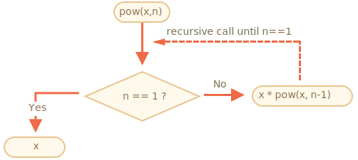
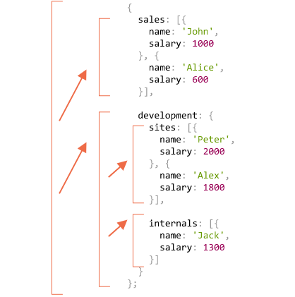
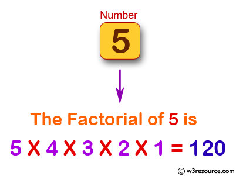
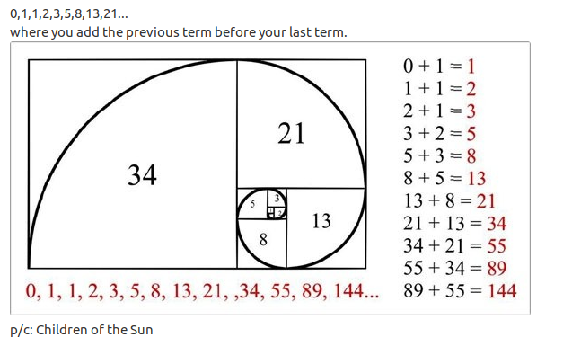

# RECURSION & STACK

La fonction s'appelle elle-même.

```
function pow(x, n) {
  if (n == 1) {
    return x;
  } else {
    return x * pow(x, n - 1);
  }
}
```
```
function pow(x, n) {
  return (n == 1) ? x : (x * pow(x, n - 1));
}
```

même résultat que la loop

```
function pow(x, n) {
  let result = 1;

  for (let i = 0; i < n; i++) {
    result *= x;
  }

  return result;
}
```



Quand un fonction fait un appel imbriqué, il ce passe ceci.

* la fonction courante est stoppée.
* Le contexte d'exécution qui lui est associé est mémorisé dans une structure de données spéciale appelée pile de contexte d'exécution (STACK)
* l'appel imbriqué (fonction dans la fonction) est exécuté.
* A la fin, l'ancien contexte d'exécution est extrait de la pile et la fonction externe reprend à l'endroit où elle s'est arrêtée.

## Recursive Transversal.

comme un arbre - stucture d'une entreprise

exemples :



## Recursive structure.

HTML documents a une structure recursive.

### linked list.

```
let list = {
  value: 1,
  next: {
    value: 2,
    next: {
      value: 3,
      next: {
        value: 4,
        next: null
      }
    }
  }
};
```
ou 

```
let list = { value: 1 };
list.next = { value: 2 };
list.next.next = { value: 3 };
list.next.next.next = { value: 4 };
```
#### Découper en plusieurs liste

```
let secondList = list.next.next;
list.next.next = null;
```

#### Joindre les 2 listes.

```
list.next.next = secondList;
```

#### Ajouter une valeur.

```
let list = { value: 1 };
list.next = { value: 2 };
list.next.next = { value: 3 };
list.next.next.next = { value: 4 };

list = { value: "new item", next: list };
```

#### Supprimer une valeur.

```
list.next = list.next.next;
```

## Additionner les valeurs de l'Array.

```
sumTo(1) = 1
sumTo(2) = 2 + 1 = 3
sumTo(3) = 3 + 2 + 1 = 6
sumTo(4) = 4 + 3 + 2 + 1 = 10
...
sumTo(100) = 100 + 99 + ... + 2 + 1 = 5050
```
* Loop
```
function sumTo(n) {
  let sum = 0;
  for (let i = 1; i <= n; i++) {
    sum += i;
  }
  return sum;
}

alert( sumTo(100) );
```
* Recursion
```
function sumTo(n) {
  if (n == 1) return 1;
  return n + sumTo(n - 1);
}

alert( sumTo(100) );
```
* Math
```
function sumTo(n) {
  return n * (n + 1) / 2;
}

alert( sumTo(100) );
```


## Factorial.



## Fibonacci.



```
function fib(n) {
  return n <= 1 ? n : fib(n - 1) + fib(n - 2);
}

alert( fib(3) ); // 2
alert( fib(7) ); // 13
// fib(77); // sera très très lent.
```
