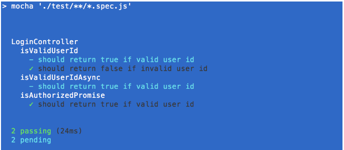

# MOCHA

## Connexion.

Vérifier l'installation de npm et nodejs V4 minimum.
`npm -v` // will return installed npm version
`node -v` // will return installed node version.

`npm install --global mocha` pour installation global

`npm install --save-dev mocha` pour installation dans un projet dans package.json

dans package.json :

```
"scripts": {
    "test": "mocha"
  }
```

## Code.

```
const assert = require('assert');
// détermine la panne du test.

// fonction = nom du test + fonctions des différents tests **describe** incluant **it** pour chaque test.
describe('Test Name', function () {
 it('should return number of charachters in a string', function () {
        assert.equal("Hello".length, 4);
    }); it('should return first charachter of the string', function () {
        assert.equal("Hello".charAt(0), 'H');
    });
});
```

## initialiser les tests.

- cloner le repo suivant
  https://github.com/npatro/javascript-unit-testing-with-mocha

- installer les dépendances depuis package.json
  `npm install`

- faire les tests
  `npm test`

Pour le resultat suivant


**Assertion** - expression pour aider le système, Mocha dans ce cas, à trouver le code du test en échec.
**Assert** pour renvoyer l'erreur si l'expression du test ne pas passe pas.

## Tester une fonction.

depuis le fichier test ou spec.

```
// **code**
function LoginController() {function isValidUserId(userList, user) {
   return userList.indexOf(user) >= 0;
}return {
    isValidUserId
  }
}
module.exports = LoginController();


//**Test**
it('should return true if valid user id', function(){
      var isValid = loginController.isValidUserId(['abc123','xyz321'], 'abc123')
      assert.equal(isValid, true);
});
```

## Test des fonctions asynchrones "callback".

Mocha attend alors la fonction **done()** pour être appelé et effectuer le test.

```
// Code
function isValidUserIdAsync(userList, user, callback) {
    setTimeout(function(){
      callback(userList.indexOf(user) >= 0)
    }, 1);
}

// Test
it('should return true if valid user id', function(done){
  loginController.isValidUserIdAsync(['abc123','xyz321'], 'abc123',
     function(isValid){
      assert.equal(isValid, true);
      done();
  });
});
```

## Méthode **beforeEach()** et **afterEach()**.

Pour certains codes il faut parfois exécuter des fonctions avant ou après chaque test pour configurer les conditions préalables avant test ou nettoyager après test, par les méthodes **beforeEach()** et **afterEach()**.

```
beforeEach('Setting up the userList', function(){
  console.log('beforeEach');
  loginController.loadUserList(['abc123','xyz321']);
});describe('LoginController', function () {
...
}
```

## TDD & BDD avec **chain**.

**TDD ("Test Driven Development")**, le test vérifie la mise en œuvre des fonctionnalités. Amesure que le code évolue, les tests peuvent donner de faux résultats.
**BDD ("Behavior Driven Development")** est également une approche axée sur le test, mais diffère en testant le comportement réel du système du point de vue de l'utilisateur final.

Une des librairies de test s'appele **chai**, compatible avec les "framework" javascript.

`npm install --save-dev chai`

`expect` et `should`
**expect** fournit une fonction pour l'assertion.
**should** donne une propriété pour l'assertion. "should" doit être ajoutée à Object.Prototype afin que tous les objets puissent y accéder via la chaîne de prototypes.

```
const assert = require('assert');
const expect = require('chai').expect;
const should = require('chai').should();
it('should return true if valid user id', function(){
      let isValid = loginController.isValidUserId('abc123')
      //assert.equal(isValid, true);
      expect(isValid).to.be.true;
});
it('should return false if invalid user id', function(){
      let isValid = loginController.isValidUserId('abc1234')
      //assert.equal(isValid, false);
      isValid.should.equal(false);
});
```

## "Promise".

ou obtenir le test quand il est prêt avec la librairie "chai-as-promised"

`npm install --save-dev chai-as-promised`

Dans le test de la fonction "callback", la méthode `done()` informe Mocha que le test est terminé, mais avec `promise`, il suffit de renvoyer **promise** et Mocha surveillera la fin du test.

```
//code
  function isAuthorizedPromise(user){
    return new Promise(function(resolve){
        setTimeout(function(){resolve(userList.indexOf(user) >= 0)}, 10);
    });
  }
//test
const chai = require('chai');
const chaiAsPromised = require('chai-as-promised');

chai.use(chaiAsPromised).should();describe('isAuthorizedPromise', function() {
    it('should return true if valid user id', function(){
      return loginController.isAuthorizedPromise('abc123').should.eventually.be.true;
    });
});
```

## chai comme expression.

```
var should = require('chai').should();

it('should have property name with value Figo', function(){
    let car = {name:'Figo', Maker:'Ford'};
        car.should.have.property('name').equal('Figo');
});
it('Checking for null', function(){
    let car = null;
//ne peut pas lire la propriété 'should' de null)
    should.not.exist(car);
});
```

## Méthode "skip".

ou mettre en attente des tests.

```
describe('LoginController', function () {
      describe('isValidUserId', function(){
          it.skip('should return true if valid user id', function() {
      ...
    });
        it('should return false if invalid user id', function() {
      ...
    });
      });
      describe.skip('isValidUserIdAsync', function() {
          it('should return true if valid user id', function(done) {
      ...
    });
});
});
```



## Méthode "only".

ou activer seulement quelques tests.

```
describe('LoginController', function () {
    describe('isValidUserId', function() {
        it.only('should return true if valid user id', function() {
      ...
    });
        it('should return false if invalid user id', function() {
      ...
    });
      });
    describe.only('isValidUserIdAsync', function() {
        it('should return true if valid user id', function(done){
      ...
    });
});
});
```

## Méthode "it"

ou appeler des test en attente "pending"

```
describe('isValidUserId', function(){
  it('should return false if user id blank');
});
```

Certains écrivent des tests après avoir écrit du code, d'autres avant d'écrire du code et d'autres en parallèle avec du code. Tous s'accordent pour dire que les tests unitaires sont une partie essentielle du développement.
